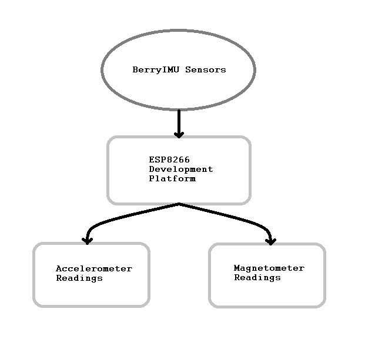

# 2019 - 2020 AutomotiveUI (IMU Sensor)
## BerryIMU + ESP8266 Build Instructions

## Table of Contents 
--------------------------------------------------------
- [Introduction](#Introduction)
- [System Diagram](#System-Diagram)
- [Components Needed (Cost)](#Components-Needed-Cost)
- [Time Commitment](#time-commitment)

--------------------------------------------------------
## Introduction
--------------------------------------------------------
BerryIMU is a third-party made PCB board that has several sensors that can be used to retrieve data. IMU stands for Inertial Measurement Unit, these are the units that relate to the movement of something. Not only is this third-party sensor capable of reading movement, but it can also read temperature, pressure, and geographical location. However, this documentation will be discussing the 
usage of this sensor to retrieve the data of basic movement and direction. Within this repository, you will find the multiple files that are available to use alongside with the instructions given for public use. These files can aid in the installation of the hardware and the software needed for the basic functionality of retrieving intertial and directional data. 

## System Diagram

Using the system diagram above, you can visualize how the BerryIMU interacts with the ESP8266 Development platform to retrieve the readings of the sensors within it. Although there are only two sensors that are being read within the above diagram, there are still several more sensors that can be used to retrieve data. 

## Components Needed (Cost)
-------------------------------------------------------

The cost of the product depends on what type of services are available to you as a student or individual. If there are services near you that offer fine 3D printing services and fine PCB services at no cost, you may ignore the optional costs of this project. The necessary components of this project are stated within the first image of this section. Due to the main sensor, BerryIMU, being made by a third-party in Australia. The shipping of this component may take longer than the others listed. Most of these components may ship to you at no cost due to the availability of them on Amazon. 

The minimum cost of the project can be $140.44; however, if third-party manufacturing and printing services are needed, the upper cost can be $206.97.

## Time Commitment
-------------------------------------------------------
By using this documentation, a user can potentially finish this project within a day to three days depending on the avaialbility of the components needed within this project. 

On completion of this project, the final product should look like the following pictures below: 

Although a user using this documentation can develop the project in three days with this documentation. The planning of this project took a span of 3 months to plan out the implementation of the PCB board, enclosure, and multiple testing as seen below. 

This is due to the extra time needed to work out errors that have occured and the switching of development platforms and remaking of PCB board and enclosures to meet the new components needed. The components that are shown as needed in the [budget](#components-needed-cost) portion above have the unnecessary products taken out. If you would like to see the the previous components that were used, the may be found [here](documentation/ProjectBudget.pdf).