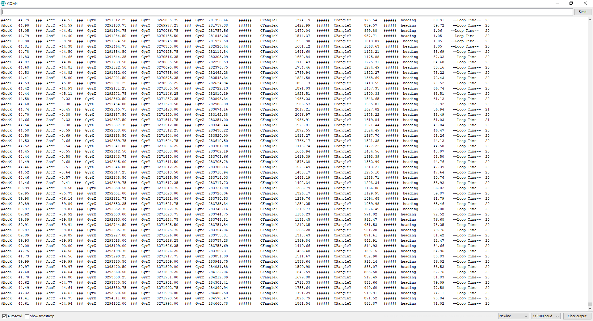

# 2019 - 2020 AutomotiveUI (IMU Sensor)
## BerryIMU + ESP8266 Build Instructions

## Table of Contents 
--------------------------------------------------------
- [Introduction](#Introduction)
- [System Diagram](#System-Diagram)
- [Components Needed (Cost)](#Components-Needed-Cost)
- [Time Commitment](#time-commitment)
- [Mechanical Assembly](#mechanical-assembly)

--------------------------------------------------------
## Introduction
--------------------------------------------------------
BerryIMU is a third-party made PCB board that has several sensors that can be used to retrieve data. IMU stands for Inertial Measurement Unit, these are the units that relate to the movement of something. Not only is this third-party sensor capable of reading movement, but it can also read temperature, pressure, and geographical location. However, this documentation will be discussing the 
usage of this sensor to retrieve the data of basic movement and direction. Within this repository, you will find the multiple files that are available to use alongside with the instructions given for public use. These files can aid in the installation of the hardware and the software needed for the basic functionality of retrieving intertial and directional data. 

## System Diagram

Using the system diagram above, you can visualize how the BerryIMU interacts with the ESP8266 Development platform to retrieve the readings of the sensors within it. Although there are only two sensors that are being read within the above diagram, there are still several more sensors that can be used to retrieve data. 

## Components Needed (Cost)
-------------------------------------------------------

The cost of the product depends on what type of services are available to you as a student or individual. If there are services near you that offer fine 3D printing services and fine PCB services at no cost, you may ignore the optional costs of this project. The necessary components of this project are stated within the first image of this section. Due to the main sensor, BerryIMU, being made by a third-party in Australia. The shipping of this component may take longer than the others listed. Most of these components may ship to you at no cost due to the availability of them on Amazon. 

The minimum cost of the project can be $140.44; however, if third-party manufacturing and printing services are needed, the upper cost can be $206.97.

## Time Commitment
-------------------------------------------------------
By using this documentation, a user can potentially finish this project within a day to three days depending on the avaialbility of the components needed within this project. 

On completion of this project, the final product should look like the following pictures below: 

Although a user using this documentation can develop the project in three days with this documentation. The planning of this project took a span of 3 months to plan out the implementation of the PCB board, enclosure, and multiple testing as seen below. 

This is due to the extra time needed to work out errors that have occured and the switching of development platforms and remaking of PCB board and enclosures to meet the new components needed. The components that are shown as needed in the [budget](#components-needed-cost) portion above have the unnecessary products taken out. If you would like to see the the previous components that were used, the may be found [here](documentation/ProjectBudget.pdf).

## Mechanical Assembly
------------------------------------------------------------
### Step One : Setting up the Adafruit Feather Huzzah ESP8266

Before connecting the sensor to the development platform, ESP8266, you should setup the development platform itself. The development platform should be enabled to be programmed through the Arduino IDE (Integrated Development Environment). 

To start, you would need to [download the Arduino IDE from Arduino.cc](https://www.arduino.cc/en/Main/Software).

Next, you would have to integrate the board drivers of the ESP8266 into the Arduino IDE by copying the following:

    http://arduino.esp8266.com/stable/package_esp8266com_index.json

This link should be copied and pasted into the Additional Boards Manager URL field. This field can be found under **File > Preferences** . The window for this section should look like the following: 

Next, you will have to navigate to the board manager through the top menu using: **Tools > Boards > Board Manager** . You will then have to install the ESP8266 board drivers and made by the Arduino Community. The screen of the board manager will appear as this in Windows: 

After the installation, you may connect the ESP8266 development platform to your computer / laptop using a MicroUSB to USB cable to a USB Port of your device. After connecting, you will have to select the correct port of your ESP8266 platform. This is done through the top menu using **Tools > Port > COM#**, you will have to select the correct COM port of your device. 

After the sucessful connection of your platform, you will then need to test your platform by running a simple **Blink Test** by using the following code:

    void setup() {
    pinMode(0, OUTPUT);
    }
 
    void loop() {
    digitalWrite(0, HIGH);
    delay(500);
    digitalWrite(0, LOW);
    delay(500);
    }

Upon the successful uploading of this code to your platform, you shall see the LEDs of the ESP8266 to be blinking. 

### Step Two: Connection of the BerryIMU Sensor

The next step would be the connection of the BerryIMU sensor to the development platform itself. The best way to do this would be to first solder male headers to the sensor itself. In the following locations:

After soldering male headers to those pinouts of BerryIMU sensor on the right, you can then use several female to female wires to connect the sensor to the platform like the diagram above. 

## Step Three: Implementing Code For Testing

The next step would be to implement the code for testing the sensors itself and if they're capable of reading gyrometer, magnetometer, and accelerometer data. To do this, you can start a new sketch within the Arduino IDE and have the main file include the code within the BerryIMU.ino file. 

- [BerryIMU.ino File](software/BerryIMU%20Codes/BerryIMU.ino) 

You can then include the following files within the same folder of the main BerryIMU.ino file: 

- [IMU.cpp File](software/BerryIMU%20Codes/IMU.cpp)
- [IMU.h File](software/BerryIMU%20Codes/IMU.h)
- [LSM9DS0.h File](software/BerryIMU%20Codes/LSM9DS0.h)
- [LSM9DS1.h File](software/BerryIMU%20Codes/LSM9DS1.h)

When implemented correctly, your Arduino IDE window should look like the following: 

### Step Four: Uploading and Checking Readings

After the implementation, you may now upload the program into the ESP8266 development platform. After the successful upload of the program, you can open the Serial Monitor within the Arduino IDE to see the readings of the sensor. To test for movement, you may move the sensor around and check for movement in the readings. 

The Serial Monitor can be found in the same top menu of Arduino IDE under **Tools > Serial Monitor**. When the correct window is open, the screen will look like the following: 

When you have achieved the window above, you are halfway complete the project and ready for the soldering of the PCB and creation of the enclosure. 