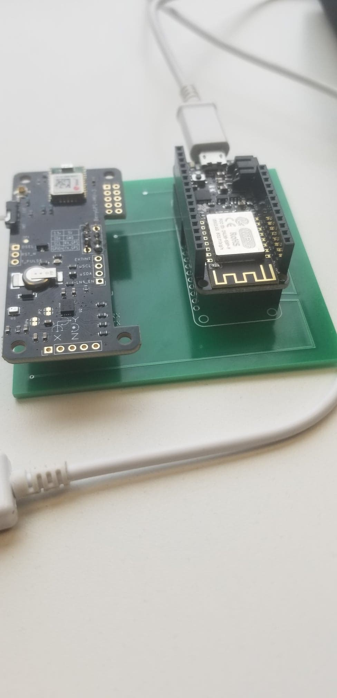
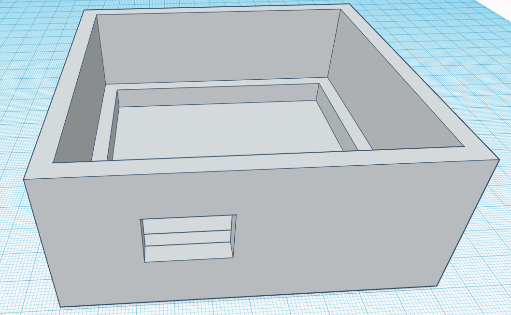
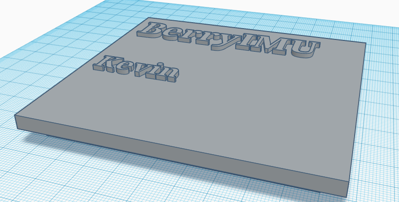
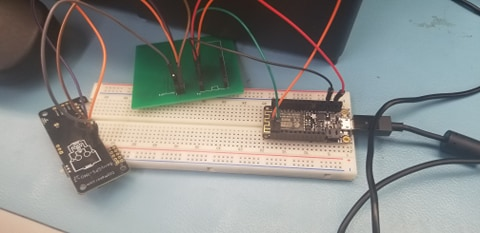
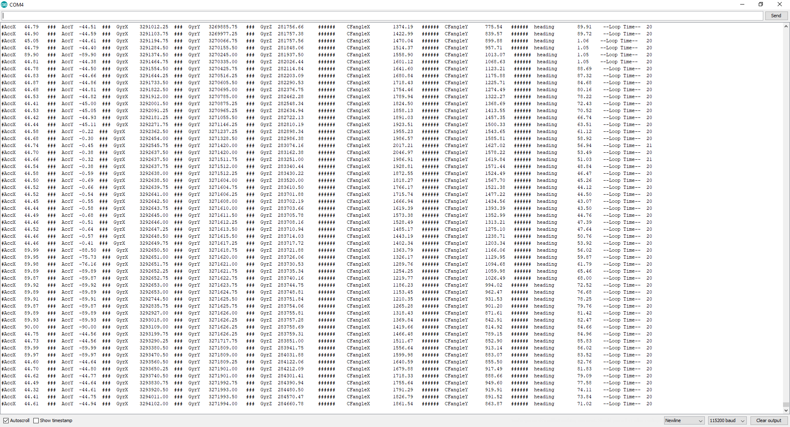
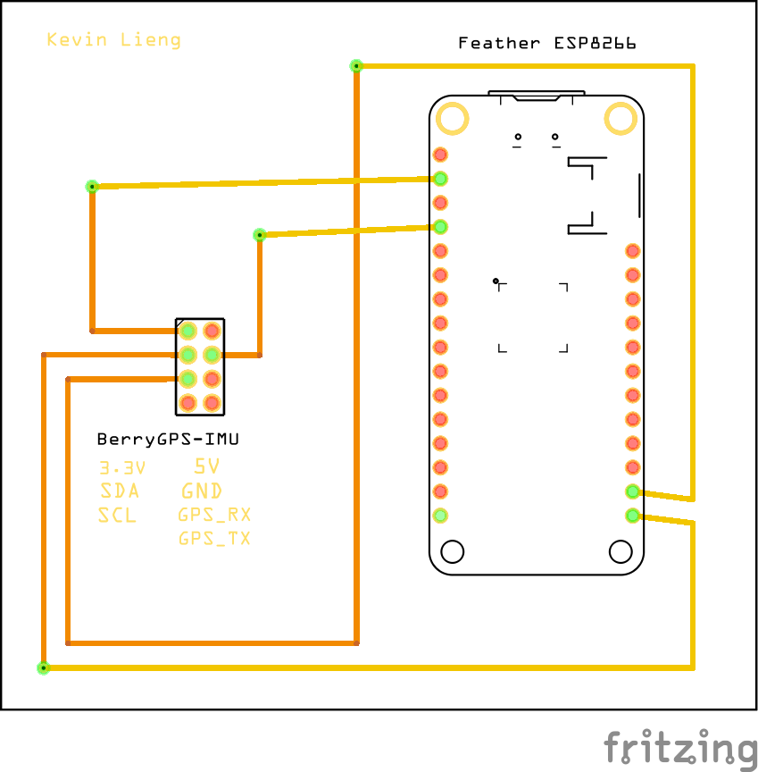
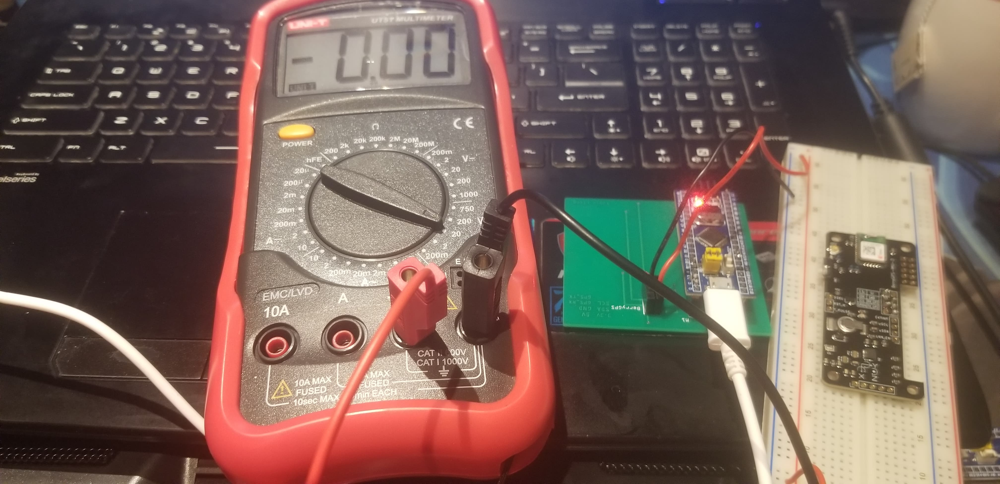
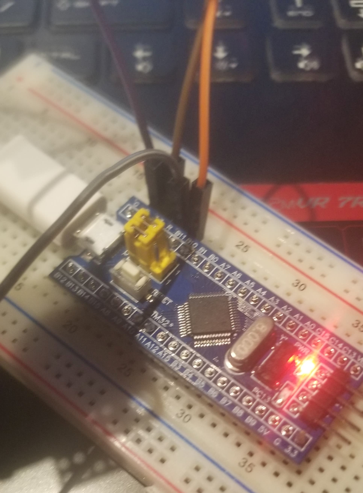
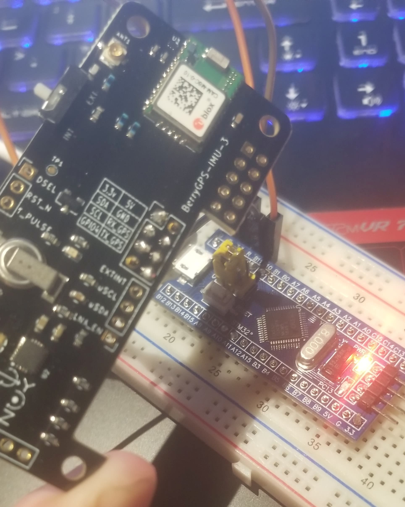
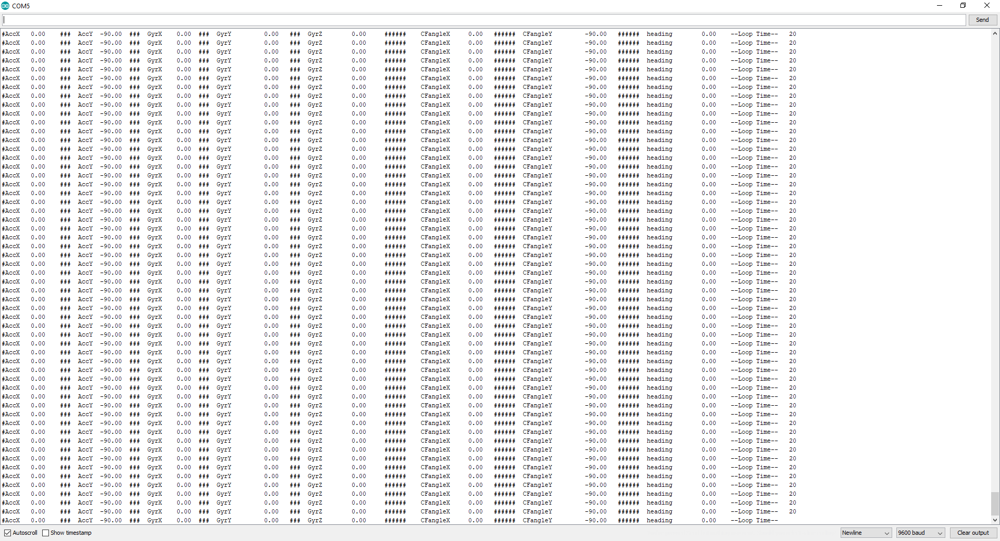

# EmergensUI Blog

#### Blog Entry #14 (November 18, 2019)

On this date, I received the new PCB that I designed for my new development platform ESP8266. It was after I soldered the new PCB and tested the product that I redesigned my enclosure with new dimensions. The problem with my casing however, is that it would take too long to print at school. Therefore I have outsourced my 3D printing job out to a third-party service and a friend with a 3D printer to expedite the printing job. 

The new PCB board that I received allows the attachment of both the sensor and development platform to be attached directly to the board through female headers. 

In this blog post, I have included pictures of my new PCB and its attachments, pictures of the enclosure and the lid, and the files that are required to print the enclosure in general. 

The new PCB with the development platform and sensor attached. 

I created this enclosure through the use of an online CAD program called TinkerCAD and exported the STL files included below: 

[PCBEnclosure](https://github.com/kevin-lieng/emegensui-automotive-ui/blob/master/mechanical/PCBEnclosureFixed.stl)

[PCBEnclosureLid](https://github.com/kevin-lieng/emegensui-automotive-ui/blob/master/mechanical/PCBEnclosureLidFixed.stl)

#### Blog Entry #13 (November 12, 2019)

Achieved results with my testing today with the new development platform (Adafruit Feather Huzzah! ESP8266), it proved that the PCB board was not the problem but my previous development platform the STM32 blue pill. When connecting the sensor and development platform to the customized PCB, I was able to retrieve results. 

These results can be shown in the pictures below. However the new PCB board that I have designed will have both of them fitting onto one board. The new design will also be posted below. 

Due to this issue, I am behind schedule by a week, but I can catch up using dimensions of the new PCB board, sensor, and development platform. 

#### Blog Entry #12 (November 12, 2019)
Although my PCB was capable of turning on, it wasn't possible for it grab readings due to the previous errors. I have ordered my new IDE and PCB with redid fritzing for a new PCB part. Due to this error, my financial budget went over the said amount that was stated in the previous parts. With the retrieval of my new part, I was able to read the sensor through testing constantly because of this constant reading that I'm able to get, I have ordered a PCB board along to go along with the new IDE. 

The new fzz file for the schematic of my build can be found here. 

[Huzzah! + Sensor Fzz](https://github.com/kevin-lieng/emegensui-automotive-ui/blob/master/electronics/Feather%20%2BBerryIMU%20%20Remake%20PCB.fzz)
#### Blog Entry #11 (November 7, 2019)
After thorough testing my soldered PCB, I finally discovered the reason why my sensor had not been working with my Blue Pill, the voltage that it's been sending out to the sensor wasn't strong enough to turn on the sensor in the first place, but it still ran the program without reading anything, such as seen in the prior posts. 

Further evidence can be seen here in the image below. 

According to the above picture, you can see that the portions where it should be giving out 3.3V isn't doing so. Even when the voltmeter is attached directly on both 3.3V and GND, it cannot read 3.3V . Therefore, I have decided to switch IDEs completely, but still working on arduino type coding. The next IDE I've decided to tryout is the Adafruit Feather Huzzah! ESP8266 that also works through ArduinoIDE code. 

#### Blog Entry #10 (October 29, 2019)

Demonstrated my breadboarded demo to Professor Kristian Medri; however, it seemed to not be reading correctly. SDA and SCL data transmission didn't seem to work correctly between the Arduino and my sensor. There may have to be a change in IDE or Development platform. However, gotta first recheck the addresses on the sensors to see where the SDA and SCL are reading from. 

Pictures of the breadboarded demo can be found below.
Codes can also be found in the current folder on github.

[Codes](https://github.com/kevin-lieng/emegensui-automotive-ui/tree/master/software/BerryIMU%20Codes)

Breadboarded Arduino + Sensor Design + Readings

#### Blog Entry #9 (October 15, 2019)

Created the PCB board for the project, uploaded the schematics, breadboard design, and pcb design. I made some mistakes, during my PCB arrangement but received 
help from Professor Kristian Medri. I have made the corrections and reuploaded revised versions of each below section of my PCB and Breadboard design below.

[Schematics](https://github.com/kevin-lieng/emegensui-automotive-ui/blob/master/electronics/PCB%20Schematic.png)

[Breadboard Design](https://github.com/kevin-lieng/emegensui-automotive-ui/blob/master/electronics/PCB%20Breadboard%20Design.png)

[PCB](https://github.com/kevin-lieng/emegensui-automotive-ui/blob/master/electronics/PCB%20Board%20Plan%20-%20Revised.png)

[Fizz File](https://github.com/kevin-lieng/emegensui-automotive-ui/blob/master/electronics/NoSTM32.fzz)

Images can also be viewed below this post. 

We have also met with our colloborator Professor Dennis Kappen after our PCB check up. We have received some feedback and what he believes will help us during our future
software and hardware plans for the rest of the system.

#### Blog Entry #8 (October 8, 2019)

Confirmed purchases with the rest of the group, retrieving headers for the connections of Blue Pill and Sensors.

#### Blog Entry #7 (October 1, 2019)

Orders for the items included in the budget have been placed. Proof of purchases of those orders have been uploaded to github to be made for viewing. 

Links for the document have been included below.

[Proof of Purchases](https://github.com/kevin-lieng/emegensui-automotive-ui/blob/master/documentation/ProofOfPurchases.pdf)

#### Blog Entry #6 (September 24, 2019)

Previously discussed the budget with the group of EmergensUI and the different sensors that we're all going to use, made sure that each of our sensors correspond to our proposal properly. 

Current budget for my portion can be found here. 

[Budget Excel Sheet](https://github.com/kevin-lieng/emegensui-automotive-ui/blob/master/documentation/ProjectBudget.xlsx)

[Budget PDF](https://github.com/kevin-lieng/emegensui-automotive-ui/blob/master/documentation/ProjectBudget.pdf)

#### Blog Entry #5 (September 18, 2019)

Rediscussed the software project with Professor Austin Tian, confirmed that we're working on HUD2 (Driver Assist) and trying to improve the pre-existing one. Got verification from Austin Tian that our idea in including a medical information tab within the vehicle dashboard. 

#### Blog Entry #4 (September 17, 2019)

Discussed the project schedule with the group members and included several project notes to serveral tasks to indicate that they have been completed. Will update schedule as more tasks are completed.

Uploaded and handed in project schedule to Professor Kristian Medri. 
Uploaded copy can be found on GitHub. 

Click [here for schedule pdf](https://github.com/kevin-lieng/emegensui-automotive-ui/blob/master/documentation/AutomotiveUIProjectSchedule_SGanttChart.pdf).

#### Blog Entry #3 (September 10, 2019)
Uploaded and handed in the proposal of the hardware section of the EmergensUI to GitHub and to Professor Kristian Medri. 

Click [here for proposal](https://github.com/kevin-lieng/emegensui-automotive-ui/blob/master/documentation/ProposalContentStudentNameRev03.pdf). 

Also met up with Professor Dennis Kappen today for a further explanation of the specific scenario of the Vehicle Digital Dashboard. Discovered there were two separate versions of this. 

HUD1 - The augmented digital dashboard for augmented video/audio information for the partner within the Ambulance. Relays audio/video messages from the dispatcher to display augmented scenario and help within the HUD or this section of the dashboard.

HUD2 - The driver assist of the digital dashboard. Relays GPS and vehicle information to the driver to aid the driver en-route to the patient and back to the hospital. 

We've decided to work and try to improve the HUD2 portion of the digital dashboard and include some medical information for the driver to access and view to make good speed estimates when driving.

#### Blog Entry #2 (September 09, 2019)
After much discussion amongst the group members and retrieving more details of the project from Professor Austian Tian and Professor Kristian Medri throughout the weekend. The group has discussed the different sensors that we are capable of doing to recreate a digital dashboard that may be in working condition. After our many decisions we were all able to finish our proposal and push the changes onto our own repositories. 

#### Blog Entry #1 (September 05, 2019)

It was on this date that we joined up as a group and chose the automotive UI and digital dashboard. After making collaborating together, we each created our own repository. 
